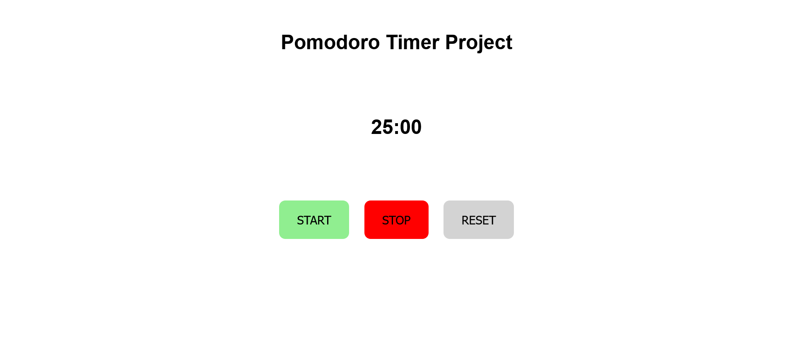

Welcome 👋🏽🫂

## Intro
This is one of the many projetcs from [100jsprojects](https://www.100jsprojects.com/project/pomodoro-timer)

## Project description

The objective of this project is to design a Pomodoro timer that features a countdown clock and three functional buttons, namely start, stop, and reset. Upon clicking the start button, the timer will commence counting down from 25 minutes. Should one desire to halt the countdown, the stop button can be pressed. The countdown can be resumed by hitting the start button, and by clicking on the reset button, the timer will reset to 25 mins again. An alert will notify the user when the timer reaches zero. This Pomodoro timer is an ideal tool for individuals seeking to focus on a task for a set amount of time, followed by a break. By implementing this technique, productivity and time management skills can be improved. 

- Live Site URL: - [Live site](https://fem-pricing-component.onrender.com)

Coded with ❤️ by [Viki Wainaina](https://twitter.com/vykiddeh_)

**Have fun building!** 🚀